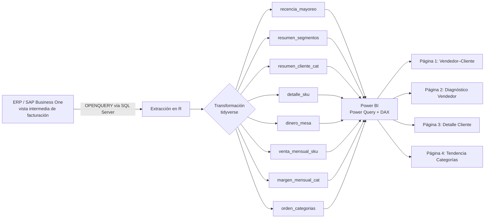

# recency-reactivation-r-powerbi
Pipeline de analítica de recencia y reactivación de clientes (R + SQL Server + Power BI) para una división de ventas mayoristas — ABC dual, modelado de ciclo de recompra y tablero interactivo de 4 páginas.

# Sistema de Analítica de Recencia y Reactivación de Clientes — División Mayoreo

**Stack:** R (tidyverse, DBI/odbc) · SQL Server (OPENQUERY sobre SAP Business One) · Power BI (Power Query + DAX)
**Rol:** Analista único — diseño, extracción, modelado y visualización end-to-end

---

## Contexto de negocio

Una cadena regional de materiales de construcción (noreste de México) opera una división de Mayoreo cuya venta está fuertemente concentrada en una sola categoría del catálogo. El objetivo del negocio es diversificar la mezcla de venta hacia categorías adicionales dentro de la misma base de clientes, mejorando la rentabilidad global de la cartera.

El problema, en términos analíticos: **¿qué clientes compraban categorías de mayor margen y dejaron de hacerlo, con qué frecuencia compraban, y qué tan lejos están hoy de su patrón normal de compra?**

No existía ninguna herramienta que respondiera esto a nivel cliente × categoría × SKU. Se construyó desde cero.

---

## Arquitectura del pipeline

El script de R corre en dos versiones: una versión de diagnóstico (con validaciones y exports para revisión) y una versión limpia dedicada exclusivamente a alimentar Power Query, sin efectos secundarios.

---

## Decisiones técnicas clave (y por qué importan)

- **Selección de fuente de datos por descarte explícito.** Se evaluaron tres vistas candidatas del data warehouse; solo una vinculaba cliente, costo y utilidad a nivel transacción para Mayoreo. Las otras dos se descartaron por razones documentadas (una no vinculaba cliente, otra correspondía a un canal de venta distinto que no aplica al modelo operativo de Mayoreo). Documentar el descarte, no solo la elección, es lo que hace la decisión auditable.

- **Doble clasificación ABC: global y por vendedor.** La misma cartera de clientes se clasifica bajo dos reglas 80/20 distintas — una sobre el total de Mayoreo, otra dentro de la cartera de cada vendedor — porque un cliente "C" a nivel compañía puede ser "A" dentro de la cartera de su vendedor. Sin esta distinción, el diagnóstico por vendedor pierde sentido.

- **Vendedor asignado por SKU, no por cliente.** Un mismo cliente puede tener distintos vendedores según la categoría que compra; el vendedor "dueño" de cada SKU se calcula tomando la transacción más reciente de esa combinación cliente-SKU, no un vendedor fijo a nivel cliente.

- **Regla de negocio explícita para la categoría de mayor rotación.** La categoría de obra negra se trata con una ventana de ciclo fija y corta (días), separada del resto del catálogo, porque su patrón de recompra es estructuralmente distinto — tratarla con la misma lógica que el resto habría generado falsos "vencidos" de forma sistemática.

- **Iteración honesta sobre el estado de ciclo de recompra.** La primera versión del modelo usaba la desviación estándar poblacional de la subfamilia como margen de tolerancia para definir un estado intermedio ("próximo a compra"). Al revisar la distribución resultante, esa tolerancia distorsionaba la señal más de lo que la afinaba. Se simplificó el modelo a tres estados claros y accionables. Quedarse con el modelo más simple que funciona en vez del más sofisticado que no aporta señal fue la decisión correcta.

- **Separación de valores "vigentes" vs. "históricos" en el mismo `summarise`.** Las métricas de año en curso y las acumuladas históricas (usadas para ABC) se calculan en la misma pasada de agregación para evitar duplicación de filas en los joins posteriores hacia Power BI — un error común cuando se agregan a niveles de granularidad distintos por separado.

---

## Modelo de datos

| Tabla | Grano | Propósito |
|---|---|---|
| `recencia_mayoreo` | Cliente | Segmentación de recencia (Activo / En riesgo / Inactivo / Alejado) |
| `resumen_segmentos` | Segmento | KPIs agregados para tablero ejecutivo |
| `resumen_cliente_cat` | Cliente × Categoría | ABC dual, margen, venta vigente vs. histórica |
| `detalle_sku` | Cliente × SKU | Detalle transaccional a nivel producto |
| `dinero_mesa` | Cliente × SKU | Frecuencia de recompra y estado de ciclo |
| `venta_mensual_sku` | Cliente × SKU × Mes | Serie mensual para tendencias |
| `margen_mensual_cat` | Cliente × Categoría × Mes | Serie mensual de margen |
| `orden_categorias` | Categoría | Orden de leyendas por venta total |

Ocho tablas relacionadas mediante llaves compuestas (`Cliente-Categoría`, `Cliente-SKU`), diseñadas para servir cuatro vistas de Power BI sin duplicar lógica de negocio entre ellas.

---

## Tablero (Power BI, 4 páginas)

1. **Vendedor–Cliente** — comportamiento de compra mes a mes y estado de ciclo por SKU, con formato condicional.
2. **Diagnóstico Vendedor** — scorecards de margen y venta del año en curso, matriz ABC, participación por categoría.
3. **Detalle Cliente** — drill-down cliente → categoría → SKU.
4. **Tendencia Categorías** — evolución mensual de margen y venta, para monitorear si la mezcla se está moviendo hacia categorías de mayor rentabilidad.

Medidas DAX diseñadas para mantener consistencia entre páginas (p. ej. margen ponderado calculado de forma idéntica en scorecards y en las series de tendencia).

---

## Estado y próximos pasos

- El pipeline y el tablero estuvieron operativos, con adopción por el equipo comercial, durante aproximadamente un mes.
- El proyecto quedó discontinuado por dos restricciones de infraestructura ajenas al diseño del modelo: la licencia de Power BI Pro requerida para el modelo de datos expiró, y el área de TI decidió no instalar R Server en el servidor gateway — requisito indispensable para que Power BI Service pudiera refrescar automáticamente un modelo con fuente de datos en R.
- **Lección de arquitectura:** cualquier pipeline que dependa de R como fuente de datos para Power BI Service necesita, sin excepción, un motor de R accesible por el servicio de refresco (R Server instalado por TI, o un gateway local en una máquina siempre encendida). Es una dependencia de infraestructura que conviene resolver *antes* de invertir en el modelo de datos, no después — en retrospectiva, hubiera validado esa dependencia con TI desde el diseño inicial.
- Roadmap de negocio que quedó pendiente: ventanas de ciclo diferenciadas por categoría (v2), análisis geoespacial por zona de venta, y visibilidad de línea de crédito por cliente.

## Cómo se habría medido el éxito

El proyecto se usó muy poco tiempo para generar resultados medibles a escala, pero el diseño de medición contemplaba:

- **Tasa de reactivación por segmento** — clientes que pasan de "Alejado" / "Inactivo" a compra activa en categorías distintas a la de mayor rotación.
- **Crecimiento de canasta cruzada por cliente** — número de categorías distintas compradas mes a mes por el mismo cliente.
- **Cambio en la mezcla de margen mensual a nivel categoría** — usando `margen_mensual_cat` como base de comparación entre periodos.

No hay resultados que reportar sobre estas métricas — y está bien decirlo así. Mostrar cómo se diseñaría la medición del éxito es, en una entrevista, un argumento más sólido que un número sin contexto.

---

## Habilidades demostradas

`R` · `tidyverse` · `SQL` (OPENQUERY, joins entre sistemas) · `Power BI` · `DAX` · diseño de modelos de datos relacionales · segmentación RFM-like · clasificación ABC · diseño de pipelines para consumo en BI · toma de decisiones metodológicas documentadas y auditables

---

## Bullets listos para CV

- Diseñé y construí de forma independiente un pipeline de analítica de recencia y reactivación de clientes (R + SQL Server + Power BI) para una división de ventas mayoristas, integrando 8 tablas relacionadas en un tablero interactivo de 4 páginas, adoptado operativamente por el equipo comercial.
- Evalué y descarté múltiples fuentes de datos candidatas documentando el razonamiento, seleccionando la única vista capaz de vincular cliente, costo y utilidad a nivel transacción.
- Diseñé un modelo de clasificación ABC dual (global y por vendedor) y una lógica de estado de ciclo de recompra a nivel SKU, iterando el modelo tras diagnosticar que una tolerancia estadística inicial distorsionaba la señal — simplificándolo a un modelo de 3 estados más claro y accionable.
- Apliqué reglas de negocio diferenciadas por categoría (ventana de ciclo corta para productos de alta rotación) en vez de un umbral único, evitando falsos positivos sistemáticos en la señal de reactivación.

*Nota honesta: el proyecto se usó cerca de un mes antes de quedar bloqueado por una licencia expirada y una decisión de TI — no hay cifras de impacto que reportar, y eso no le resta valor al caso. Si te preguntan por resultados en una entrevista, la respuesta honesta ("se usó un mes, así es como se hubiera medido el éxito, pero la infraestructura falló antes de tener datos suficientes") es más creíble que un número inventado, y además abre la conversación hacia algo que sí controlaste: el diseño técnico y metodológico.*
