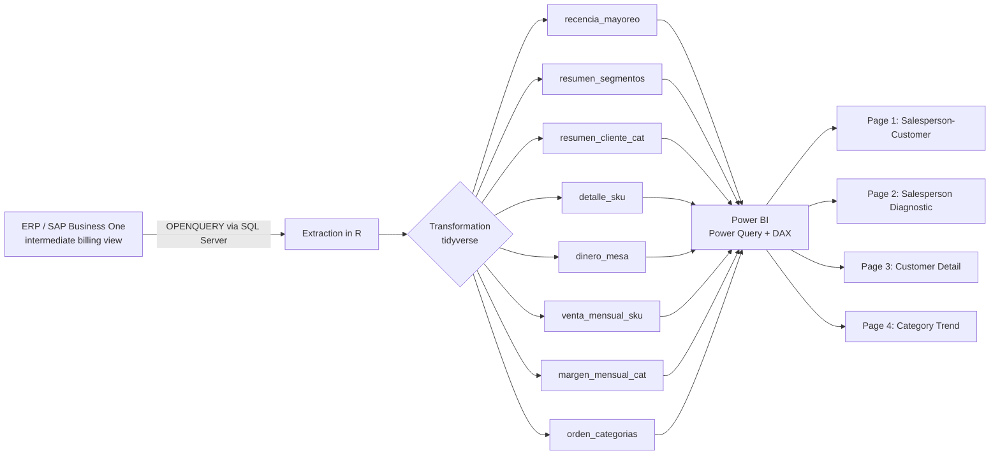

🇺🇸 English · 🇲🇽 [Español](README.es.md)

# Customer Recency & Reactivation Analytics — Wholesale Division

**Stack:** R (tidyverse, DBI/odbc) · SQL Server (OPENQUERY over SAP Business One) · Power BI (Power Query + DAX)
**Role:** Sole analyst — end-to-end design, extraction, modeling, and visualization

---

## Business context

A regional construction-materials retail chain (northeastern Mexico) runs a wholesale division whose sales are heavily concentrated in a single product category. The business goal was to diversify the sales mix toward additional categories within the same customer base, improving overall portfolio profitability.

No existing tool answered, at the customer × category × SKU level: which customers used to buy other categories and stopped, how often did they buy, and how far off-cycle are they today? It was built from scratch.

---

## Pipeline architecture

The R script runs in two versions: a diagnostic version (with validations and exports for review) and a clean version dedicated exclusively to feeding Power Query, with no side effects.

---

## Key technical decisions (and why they matter)

- **Data source selection by explicit elimination.** Three candidate warehouse views were evaluated; only one linked customer, cost, and profit at the transaction level for the wholesale channel. The other two were discarded for documented reasons (one didn't link to customer, the other belonged to a different sales channel that doesn't apply to the wholesale operating model). Documenting the elimination, not just the choice, is what makes the decision auditable.

- **Dual ABC classification: global and per-salesperson.** The same customer portfolio is classified under two separate 80/20 rules — one against total wholesale sales, another within each salesperson's own portfolio — because a "C" customer company-wide can be an "A" within their salesperson's book. Without this distinction, per-salesperson diagnostics lose their meaning.

- **Salesperson assigned per SKU, not per customer.** The same customer can have different salespeople depending on the category purchased; the "owning" salesperson for each SKU is derived from the most recent transaction for that customer-SKU pair, not a fixed salesperson at the customer level.

- **Explicit business rule for the highest-turnover category.** The highest-rotation category is handled with a fixed, short cycle window (days), separate from the rest of the catalog, because its repurchase pattern is structurally different — applying the same logic used for the rest of the catalog would have systematically generated false "overdue" flags.

- **Honest iteration on repurchase cycle status.** The first version of the model used the subfamily's population standard deviation as a tolerance band to define an intermediate state ("approaching due"). Reviewing the resulting distribution showed that tolerance distorted the signal more than it refined it. The model was simplified to three clear, actionable states. Keeping the simpler model that works over the more sophisticated one that adds no signal was the right call.

- **Separating "current" from "historical" values within the same `summarise`.** Current-year metrics and historical cumulative metrics (used for ABC) are computed in the same aggregation pass to avoid row duplication in downstream joins into Power BI — a common error when metrics at different aggregation levels are computed separately.

---

## Data model

| Table | Grain | Purpose |
|---|---|---|
| `recencia_mayoreo` | Customer | Recency segmentation (Active / At-risk / Inactive / Lapsed) |
| `resumen_segmentos` | Segment | Aggregated KPIs for executive dashboard |
| `resumen_cliente_cat` | Customer × Category | Dual ABC, margin, current-year vs. historical sales |
| `detalle_sku` | Customer × SKU | Transaction-level product detail |
| `dinero_mesa` | Customer × SKU | Repurchase frequency and cycle status |
| `venta_mensual_sku` | Customer × SKU × Month | Monthly series for trend analysis |
| `margen_mensual_cat` | Customer × Category × Month | Monthly margin series |
| `orden_categorias` | Category | Legend ordering by total sales |

Eight related tables joined via composite keys (`Customer-Category`, `Customer-SKU`), designed to serve four Power BI views without duplicating business logic between them.

---

## Dashboard (Power BI, 4 pages)

1. **Salesperson-Customer** — month-by-month purchase behavior and SKU-level cycle status, with conditional formatting.
2. **Salesperson Diagnostic** — current-year margin and sales scorecards, ABC matrix, category participation.
3. **Customer Detail** — drill-down from customer → category → SKU.
4. **Category Trend** — monthly margin and sales evolution, to monitor whether the mix is shifting toward higher-profitability categories.

DAX measures were designed to stay consistent across pages (e.g., weighted margin is calculated identically in scorecards and in trend series).

---

## Status and next steps

- The pipeline and dashboard were operational, with adoption by the sales team, for roughly one month.
- The project was discontinued due to two infrastructure constraints unrelated to the data model's design: the Power BI Pro license required for the data model expired, and IT decided not to install R Server on the gateway server — a hard requirement for Power BI Service to automatically refresh a model with an R data source.
- **Architecture lesson:** any pipeline that depends on R as a Power BI Service data source needs, without exception, an R engine reachable by the refresh service (either R Server installed by IT, or a local gateway on an always-on machine). This is an infrastructure dependency worth validating *before* investing in the data model, not after — in hindsight, this dependency should have been confirmed with IT at the initial design stage.
- Business roadmap left pending: category-differentiated cycle windows (v2), geospatial analysis by sales zone, and customer credit-line visibility.

## How success would have been measured

The project was in use for too short a time to generate results measurable at scale, but the measurement design considered:

- **Reactivation rate by segment** — customers moving from "Lapsed" / "Inactive" to active purchasing in categories other than the highest-turnover one.
- **Cross-category basket growth per customer** — number of distinct categories purchased month over month by the same customer.
- **Monthly margin mix shift at the category level** — using `margen_mensual_cat` as the basis for period-over-period comparison.

There are no results to report against these metrics — and that's fine to say plainly. Showing how success would be measured is, in an interview, a stronger argument than a number without context.

---

## Skills demonstrated

`R` · `tidyverse` · `SQL` (OPENQUERY, cross-system joins) · `Power BI` · `DAX` · relational data model design · RFM-like segmentation · ABC classification · pipeline design for BI consumption · documented, auditable methodological decision-making

---

## Resume-ready bullets

- Independently designed and built a customer recency and reactivation analytics pipeline (R + SQL Server + Power BI) for a wholesale sales division, integrating 8 related tables into an interactive 4-page dashboard, operationally adopted by the sales team.
- Evaluated and eliminated multiple candidate data sources with documented reasoning, selecting the only view capable of linking customer, cost, and profit at the transaction level.
- Designed a dual ABC classification model (global and per-salesperson) and a SKU-level repurchase cycle status logic, iterating the model after diagnosing that an initial statistical tolerance was distorting the signal — simplifying it into a clearer, more actionable 3-state model.
- Applied category-differentiated business rules (short cycle window for high-turnover products) instead of a single threshold, avoiding systematic false positives in the reactivation signal.

*Honest note: the project was in use for about a month before being blocked by an expired license and an IT decision — there are no impact figures to report, and that doesn't diminish the case. If asked about results in an interview, the honest answer ("it was used for a month, here's how success would have been measured, but the infrastructure failed before enough data existed") is more credible than a made-up number, and it opens the conversation toward what you actually controlled: the technical and methodological design.*
